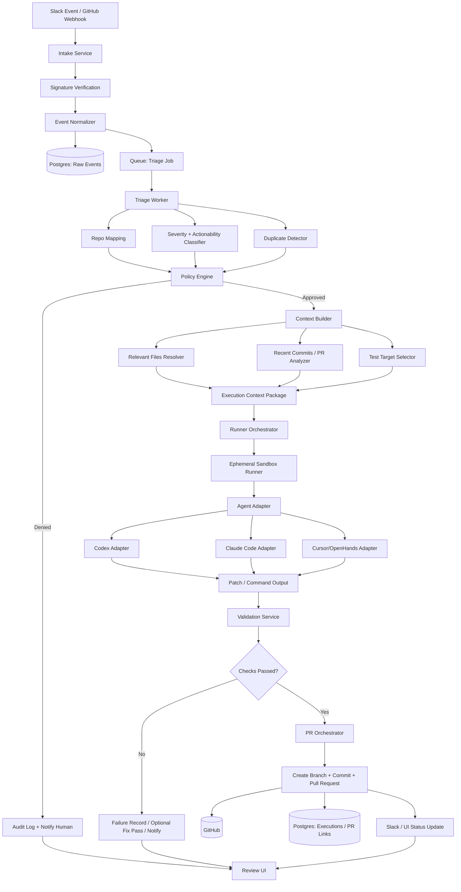

# CodePlaneAI Architecture

## 1. Product Definition

**CodePlaneAI** is an **AI incident-to-PR orchestration platform**.

It is **not** a coding model, IDE, autocomplete product, or autonomous developer.

Its core job is to:

1. ingest engineering signals,
2. decide whether they are actionable,
3. build the minimum safe context,
4. route the task to a replaceable coding agent,
5. execute inside an isolated runner,
6. validate changes,
7. open a governed PR,
8. preserve auditability and human review.

The product moat is:

- intelligent triggering,
- repo context compression,
- secure execution,
- governance and audit,
- PR lifecycle orchestration.

## 2. Product Goals

### Primary Goal

Reduce debugging, triage, and first-PR response time for engineering teams.

### Secondary Goals

- Standardize how incidents become proposed fixes.
- Make AI execution observable and policy-constrained.
- Support multiple agent providers without redesigning the platform.
- Keep humans in the approval path.

### Non-Goals for Early Versions

- Fully autonomous merges
- Automatic production deploys
- Complex multi-tenant enterprise RBAC
- Billing and usage monetization
- Training proprietary coding models
- Long-running autonomous reasoning loops
- Full internal developer portal

## 3. High-Level System

```text
Event Intake
→ Context Resolution
→ Policy Engine
→ Agent Adapter
→ Sandbox Runner
→ Validation
→ PR Orchestrator
→ Audit + Review
```

## 4. Core Architectural Principles

### 4.1 Agent as a Dependency

The coding agent is a replaceable execution dependency, not the product core.

Examples:

- `CodexAdapter`
- `ClaudeCodeAdapter`
- `CursorAdapter`
- `OpenHandsAdapter`
- `LocalAgentAdapter`

### 4.2 Event-Driven, Not Inline

Never execute agent logic directly from webhook request handlers.

Use:

```text
Webhook/API
→ Queue
→ Triage Worker
→ Planner
→ Runner
→ Validation
→ PR
```

This protects reliability, retries, rate limits, and auditability.

### 4.3 Human-in-the-Loop Forever

AI can propose code, but humans approve:

- whether execution is allowed,
- whether secrets or prod-sensitive repos are touched,
- whether the PR is accepted,
- whether follow-up execution is retried.

### 4.4 Security First

The hard problem is secure execution:

- repo cloning,
- shell command execution,
- test running,
- secret access,
- patch generation,
- network egress control.

## 5. Recommended MVP Tech Stack

This stack is intentionally pragmatic and avoids premature platform complexity.

### Backend

- **Node.js + TypeScript**
- **NestJS** or **Fastify + modular services**

Why:

- good webhook ergonomics,
- strong ecosystem,
- excellent Postgres/Redis/BullMQ support,
- typed interfaces for adapters and policies.

### Data Stores

- **Postgres** for system of record
- **Redis** for queues, locks, short-lived execution state

### Queues

- **BullMQ**

Why:

- simple operationally,
- Redis-backed,
- suitable for job orchestration, retries, and delayed work.

### Execution

- **Docker** for isolated runners
- Optional future move to **Kubernetes Jobs**

### GitHub Integration

- GitHub App
- REST/GraphQL APIs
- repo-scoped installation permissions

### Slack Integration

- Slack Events API
- slash commands or message actions later

### Observability

- **OpenTelemetry**
- **Prometheus**
- **Grafana**
- structured logs via **Pino**

### Validation Tooling

- repo-native test/lint/typecheck commands
- optional policy-defined validation packs

### Frontend / Review UI

- **Next.js**
- simple dashboard for executions, PRs, logs, approvals

## 6. Service Breakdown

For the MVP, these can live in one deployable backend with clear modules. Later, they can split into independent services.

### 6.1 Intake Service

Responsibilities:

- receive Slack events,
- receive GitHub webhooks,
- verify webhook signatures,
- normalize events into internal format,
- persist event records,
- enqueue triage jobs.

Must not:

- run agent logic,
- clone repos,
- make planning decisions,
- execute shell commands.

### 6.2 Triage Service

Responsibilities:

- classify event type,
- decide whether the event is actionable,
- infer severity,
- map event to repository/service,
- detect duplicates,
- identify likely issue category.

Examples of classifications:

- bugfix
- flaky test
- CI failure
- infra/config issue
- dependency issue
- non-actionable noise
- human-required escalation

Output example:

```json
{
  "repo": "payments-api",
  "severity": "high",
  "taskType": "bugfix",
  "confidence": 0.91,
  "duplicateOf": null,
  "executionAllowed": true,
  "reason": "Stack trace maps to payments service and matches owned repo"
}
```

### 6.3 Context Builder

Responsibilities:

- fetch relevant repo metadata,
- identify relevant files,
- inspect recent commits,
- inspect recent PRs,
- map stack traces to code locations,
- select likely tests to run,
- load ownership rules and repo constraints.

Inputs:

- normalized event,
- triage result,
- repo metadata,
- optional embeddings or search indexes later.

Outputs:

- compact, execution-ready context package.

Output example:

```json
{
  "repo": "payments-api",
  "branch": "main",
  "relevantFiles": [
    "src/payments/processor.ts",
    "src/payments/retry-policy.ts",
    "tests/payments/processor.spec.ts"
  ],
  "recentCommits": [
    "abc123",
    "def456"
  ],
  "testTargets": [
    "pnpm test -- payments",
    "pnpm lint",
    "pnpm typecheck"
  ],
  "constraints": [
    "Do not modify infra/terraform",
    "Never change billing schema without approval"
  ]
}
```

### 6.4 Policy Engine

Responsibilities:

- determine whether execution is allowed,
- evaluate repo policies,
- apply branch restrictions,
- enforce file path restrictions,
- determine if human approval is required,
- assign sandbox/network permissions,
- determine allowed agent provider.

Example policy checks:

- Is this repo automation-enabled?
- Is the event severity above auto-execute threshold?
- Is the target path in protected directories?
- Does this repo require approval for migrations?
- Are secrets needed?
- Is network egress permitted?

### 6.5 Agent Adapter Layer

This is the architectural boundary between your product and external coding agents.

#### Interface

```ts
export interface CodingAgent {
  plan(task: TaskContext): Promise<ExecutionPlan>;
  execute(context: ExecutionContext): Promise<ExecutionResult>;
  validate(input: ValidationInput): Promise<ValidationResult>;
}
```

#### Suggested Contract Expansion

```ts
export interface TaskContext {
  executionId: string;
  repo: RepoSnapshot;
  incident: IncidentContext;
  constraints: string[];
  relevantFiles: string[];
  testTargets: string[];
  policy: PolicyDecision;
}

export interface ExecutionPlan {
  summary: string;
  proposedFiles: string[];
  proposedCommands: string[];
  riskLevel: "low" | "medium" | "high";
}

export interface ExecutionContext extends TaskContext {
  workspacePath: string;
  runner: RunnerContext;
}

export interface ExecutionResult {
  status: "success" | "failed" | "needs_human";
  patchSummary: string;
  changedFiles: string[];
  commitsCreated: string[];
  commandLogRefs: string[];
  validationRequested: string[];
  notes: string[];
}

export interface ValidationInput {
  executionId: string;
  changedFiles: string[];
  testTargets: string[];
  workspacePath: string;
}

export interface ValidationResult {
  status: "passed" | "failed" | "partial";
  checks: Array<{
    name: string;
    status: "passed" | "failed" | "skipped";
    outputRef?: string;
  }>;
}
```

#### Adapter Responsibilities

- transform internal task format into provider-specific prompt/API/CLI calls,
- run provider-specific execution flow,
- normalize outputs back into common format,
- hide provider quirks from the rest of the system.

#### Adapter Non-Responsibilities

- triage,
- repo selection,
- policy decisions,
- secrets issuance,
- PR creation,
- audit model.

### 6.6 Runner Orchestrator

Responsibilities:

- allocate isolated execution environment,
- clone repo at exact commit/branch,
- inject scoped credentials,
- mount workspace,
- call selected agent adapter,
- capture stdout/stderr/artifacts,
- persist execution state.

### 6.7 Sandbox Runner

This is the highest-risk subsystem.

Responsibilities:

- isolated file system,
- process isolation,
- network egress policy,
- CPU/memory/time limits,
- artifact capture,
- credential scoping,
- cleanup on completion.

Minimum controls:

- per-execution ephemeral container,
- non-root user,
- restricted mounts,
- workspace-only write access,
- timeout and resource quotas,
- optional no-network mode,
- short-lived GitHub token,
- execution transcript recording.

Future hardening:

- Firecracker microVMs,
- gVisor,
- seccomp/apparmor,
- egress proxy,
- signed execution images.

### 6.8 Validation Service

Responsibilities:

- run repo-defined checks,
- run deterministic validation after agent execution,
- collect logs and artifacts,
- determine pass/fail/partial,
- optionally request second-pass fixes.

Validation types:

- unit tests,
- integration tests,
- lint,
- typecheck,
- build,
- static analysis,
- secret scanning,
- policy checks.

Validation strategy:

- fast checks first,
- expensive checks later,
- stop early on unsafe failures,
- never silently downgrade failed validation to success.

### 6.9 PR Orchestrator

Responsibilities:

- create branch,
- commit changes,
- generate PR title/body,
- attach execution evidence,
- label PR,
- request reviewers,
- link source incident,
- update Slack/GitHub thread.

PR body should include:

- incident summary,
- root cause hypothesis,
- changed files,
- validation results,
- known risks,
- human review notes.

### 6.10 Audit and Review Service

Responsibilities:

- preserve event-to-execution lineage,
- record policy decisions,
- store command logs,
- store prompts/context snapshots,
- track who approved what,
- display execution history in UI.

Auditability is mandatory for trust.

### 6.11 Review UI

MVP UI pages:

- executions list,
- execution detail,
- policy decision detail,
- PR outcome detail,
- manual approval screen,
- provider success/failure metrics.

## 7. End-to-End Flow

### 7.1 Main Flow

1. Slack or GitHub sends event.
2. Intake verifies signature and persists raw event.
3. Intake normalizes event and enqueues triage job.
4. Triage classifies actionability, repo, severity, and confidence.
5. Policy engine decides whether automation is allowed.
6. Context builder creates compact execution context.
7. Runner orchestrator provisions isolated workspace.
8. Agent adapter selects provider and invokes agent.
9. Agent modifies code inside sandbox.
10. Validation service runs tests/checks.
11. If validation passes or policy allows partial-output PR, PR orchestrator creates branch/commit/PR.
12. Audit trail is stored end to end.
13. Slack/GitHub receive status updates.
14. Human reviews and decides next step.

### 7.2 Failure Paths

- If triage confidence is low: route to manual review.
- If policy denies execution: record denial and notify.
- If sandbox provisioning fails: retry with backoff.
- If agent fails: mark execution failed and preserve logs.
- If validation fails: optionally run one controlled fix pass or open PR marked as failed validation.
- If GitHub write fails: preserve patch artifact for manual recovery.

## 8. System Design Flowchart



## 9. Deployment View

### MVP Deployment

- `api-service`
  - intake endpoints
  - internal admin APIs
  - review UI backend
- `worker-service`
  - triage jobs
  - context building
  - policy evaluation
  - PR jobs
- `runner-service`
  - provisions containers
  - executes adapters
  - runs validation
- `postgres`
- `redis`
- `object-storage` for logs/artifacts

### Why This Split

- keeps the synchronous API thin,
- isolates higher-risk execution from the public-facing service,
- allows worker and runner scaling independently.

## 10. Data Model

Suggested initial tables:

### `events`

- `id`
- `source_type` (`slack`, `github`)
- `source_event_id`
- `raw_payload`
- `normalized_payload`
- `received_at`
- `signature_verified`

### `repositories`

- `id`
- `provider`
- `owner`
- `name`
- `default_branch`
- `automation_enabled`
- `policy_profile_id`

### `executions`

- `id`
- `event_id`
- `repository_id`
- `status`
- `task_type`
- `severity`
- `agent_provider`
- `policy_decision`
- `started_at`
- `completed_at`

### `execution_contexts`

- `id`
- `execution_id`
- `relevant_files`
- `recent_commits`
- `test_targets`
- `constraints`
- `context_snapshot`

### `execution_logs`

- `id`
- `execution_id`
- `stage`
- `log_ref`
- `created_at`

### `validation_runs`

- `id`
- `execution_id`
- `status`
- `summary`
- `checks`
- `created_at`

### `pull_requests`

- `id`
- `execution_id`
- `provider_pr_id`
- `branch_name`
- `commit_sha`
- `url`
- `status`

### `approvals`

- `id`
- `execution_id`
- `decision`
- `decided_by`
- `reason`
- `created_at`

### `policy_profiles`

- `id`
- `name`
- `allow_auto_execute`
- `protected_paths`
- `requires_approval_for`
- `allowed_agents`
- `network_policy`
- `max_runtime_seconds`

## 11. Queue Design

Suggested BullMQ queues:

- `triage-queue`
- `context-queue`
- `execution-queue`
- `validation-queue`
- `pr-queue`
- `notification-queue`

Key design points:

- use idempotency keys from source events,
- retries with exponential backoff,
- dead-letter failed jobs,
- persist execution stage transitions in Postgres,
- use Redis locks for duplicate suppression.

## 12. Security Design

### Threat Model

You are running untrusted code operations in customer repositories.

Primary risks:

- secret leakage,
- malicious prompt-induced commands,
- dependency exfiltration,
- lateral movement,
- destructive repo changes,
- unintended infra modifications,
- audit blind spots.

### Controls

- GitHub App permissions instead of broad PATs
- short-lived credentials
- per-run ephemeral workspace
- execution allowlist for commands if needed
- protected path rules
- network-off by default for code execution where possible
- artifact retention
- immutable audit records
- no automatic merges
- human approval gates for sensitive repos

### Sensitive Repo Rules

Examples:

- migration files require approval,
- Terraform/Kubernetes manifests require approval,
- auth/billing/security folders require approval,
- package manager lockfile changes may require extra review,
- secrets-related changes always block auto-PR if scanning fails.

## 13. Context Resolution Strategy

This is one of your most important differentiators.

### Inputs to Context Builder

- stack trace / exception message
- Slack thread content
- linked issue text
- recent commits
- failing tests
- service ownership map
- repo metadata
- CODEOWNERS / config files

### Context Compression Heuristics

- prioritize files directly named in traces,
- include nearest tests,
- include only recent commits touching relevant modules,
- include ownership and policy files,
- cap token/file volume,
- prefer deterministic search over broad repository dumps.

### Future Improvements

- symbol graph indexing,
- embeddings for code search,
- historical incident-to-fix retrieval,
- PR similarity matching,
- service dependency graph traversal.

## 14. Policy Engine Design

Policy decision inputs:

- repository profile,
- event source,
- task type,
- confidence score,
- affected paths,
- requested permissions,
- agent provider,
- validation outcome.

Policy decision outputs:

- allow / deny / require approval,
- selected provider,
- network mode,
- time budget,
- validation profile,
- PR creation policy.

Example policy:

```yaml
repo: payments-api
allow_auto_execute: true
require_approval_for:
  - db/migrations/**
  - infra/**
  - src/billing/**
allowed_agents:
  - codex
network_policy: restricted
max_runtime_seconds: 900
validation_profile: standard-node
pr_policy:
  create_on_failed_validation: false
```

## 15. Agent Adapter Design Notes

### Why Adapters Matter

Without adapters, the whole platform becomes brittle whenever:

- agent APIs change,
- CLI behaviors change,
- pricing changes,
- quality shifts by provider,
- one provider becomes unavailable.

### Adapter Responsibilities in Practice

- provider auth,
- prompt template shaping,
- execution command structure,
- timeout handling,
- output normalization,
- retry semantics,
- provider-specific metadata capture.

### Adapter Selection Strategy

Early stage:

- use a simple policy rule: default to `codex`.

Later:

- choose based on repo language,
- cost ceiling,
- historical success rate,
- task type,
- required tool use.

## 16. Sandbox Design Notes

### Runner Lifecycle

1. allocate execution ID,
2. create ephemeral container,
3. mount fresh workspace,
4. clone repository,
5. checkout exact branch/commit,
6. inject least-privilege credentials,
7. invoke adapter,
8. capture file diffs and logs,
9. run validation,
10. upload artifacts,
11. destroy container.

### Isolation Requirements

- no shared writable workspace between executions,
- no persistent credentials on disk after cleanup,
- bounded runtime,
- isolated network namespace when possible,
- execution image pinned and versioned.

## 17. Validation Architecture

Validation should be deterministic and repo-specific.

### Validation Levels

- `light`: lint + typecheck
- `standard`: targeted tests + lint + typecheck
- `strict`: standard + build + integration tests + secret scan

### Why Validation Must Be Separate from Agent

The agent should not be trusted as the authority on whether its own output is correct.

Separate validation gives:

- reproducibility,
- trust,
- clearer failure reasons,
- consistent standards across providers.

## 18. Observability Requirements

You need observability across:

- webhook latency,
- queue latency,
- triage outcomes,
- provider success rate,
- runner failures,
- validation pass rate,
- PR creation success,
- time from event to PR.

### Required Metrics

- total events by source
- actionable event rate
- duplicate suppression rate
- execution success rate
- validation pass rate
- mean event-to-PR latency
- mean execution runtime
- policy denial rate
- PR acceptance rate
- per-agent provider failure rate

### Required Logs

- event receipt,
- normalization result,
- triage decision,
- policy decision,
- runner allocation,
- adapter invocation,
- validation output,
- PR creation result.

### Required Traces

- one trace spanning event → triage → execution → validation → PR.

## 19. Failure Handling and Recovery

### Retryable Failures

- webhook downstream persistence temporary failure
- queue dispatch failure
- GitHub API transient errors
- container pull failure
- artifact upload timeout

### Non-Retryable Failures

- policy denied
- unsupported repository language
- missing repo permissions
- invalid GitHub App installation
- protected path violation

### Recovery Patterns

- dead-letter queues
- manual replay from UI
- artifact-based postmortems
- partial execution state preservation

## 20. API Surface

### External APIs

- `POST /webhooks/slack`
- `POST /webhooks/github`
- `POST /api/executions/:id/approve`
- `POST /api/executions/:id/retry`
- `GET /api/executions`
- `GET /api/executions/:id`
- `GET /api/policies/:repo`

### Internal Module Interfaces

- `normalizeEvent(raw) -> NormalizedEvent`
- `triageEvent(event) -> TriageDecision`
- `buildContext(event, triage) -> ExecutionContext`
- `evaluatePolicy(context) -> PolicyDecision`
- `runExecution(context) -> ExecutionResult`
- `runValidation(execution) -> ValidationResult`
- `createPr(execution, validation) -> PullRequestResult`

## 21. Suggested MVP Repository Structure

```text
codeplaneai/
  apps/
    api/
    worker/
    runner/
    web/
  packages/
    domain/
    adapters/
      agent-codex/
      agent-claude/
      agent-local/
    integrations/
      slack/
      github/
    policy-engine/
    context-builder/
    validation/
    observability/
    shared-config/
  infra/
    docker/
    db/
    monitoring/
  docs/
    architecture/
```

If you want a simpler MVP:

```text
codeplaneai/
  src/
    intake/
    triage/
    policy/
    context/
    adapters/
    runner/
    validation/
    pr/
    audit/
    ui/
```

## 22. Phased Implementation Plan

### Phase 1: Useful MVP

Build only:

- Slack intake
- GitHub integration
- Postgres + Redis
- BullMQ queues
- triage engine
- context builder
- policy engine
- Codex adapter
- Docker sandbox runner
- validation layer
- PR creation
- minimal review UI

### Phase 2: Reliability and Hardening

- approval workflows
- artifact storage
- replay/retry tooling
- better logs/traces
- protected path policies
- duplicate suppression improvements
- better context heuristics

### Phase 3: Provider and Policy Expansion

- more agent adapters
- policy profiles by repo/team
- adaptive provider selection
- execution templates by language/framework
- richer review UI

### Phase 4: Advanced Intelligence

- retrieval from historical incidents
- code graph indexing
- semantic repo search
- change risk scoring
- incident pattern clustering

## 23. Major Tradeoffs

### Single Service vs Microservices

**MVP recommendation:** modular monolith with worker separation.

Why:

- easier iteration,
- lower operational burden,
- enough separation via queues and modules.

Tradeoff:

- later extraction work required.

### Docker vs Kubernetes First

**MVP recommendation:** Docker-managed runners first.

Why:

- faster setup,
- simpler local development,
- fewer moving parts.

Tradeoff:

- weaker scheduling/isolation primitives than mature k8s job platforms.

### BullMQ vs Temporal

**MVP recommendation:** BullMQ first.

Why:

- much simpler,
- enough for staged workflows and retries,
- lower cognitive overhead.

Tradeoff:

- less sophisticated workflow state modeling than Temporal.

### Postgres + Redis vs Full Event Sourcing

**MVP recommendation:** standard relational model plus queues.

Why:

- simple reporting,
- straightforward debugging,
- fast implementation.

Tradeoff:

- less elegant than event-sourced workflow history, but far more practical.

### Adapter Abstraction vs Direct Provider Integration

**Recommendation:** abstract early.

Why:

- provider independence is strategic,
- changing providers later is expensive.

Tradeoff:

- a bit more upfront interface design.

## 24. What You Must Know as the Senior Engineer

### Product Truths

- The product is orchestration plus governance, not code generation.
- Trust and safety matter more than maximal autonomy.
- Human review is a feature, not a limitation.
- Event-to-PR latency is the key success metric.

### Architecture Truths

- Keep webhook handlers thin.
- Queue everything meaningful.
- Separate triage, policy, context, execution, and validation.
- Make the coding agent replaceable.
- Keep validation independent from the agent.

### Security Truths

- Secure execution is the hardest engineering problem here.
- Least-privilege credentials are mandatory.
- Sensitive paths need policy gates.
- Audit records are required for trust and incident review.
- Auto-merge and auto-deploy should stay out of scope early.

### Implementation Truths

- Start as a modular monolith, not a distributed platform.
- Use Postgres, Redis, BullMQ, and Docker first.
- Add OpenTelemetry from day one.
- Build policy profiles before fancy dashboards.
- Preserve every execution artifact that explains a decision.

### Reliability Truths

- Idempotency matters at webhook and queue layers.
- Duplicate suppression matters in noisy alert channels.
- Every stage needs retry policy and failure classification.
- Preserve partial outputs so failures are debuggable.

### Adapter Truths

- Provider lock-in is a strategic risk.
- Normalize provider outputs into a single domain model.
- Capture provider metadata for benchmarking and routing later.

### Context Truths

- Better context beats more autonomous prompting.
- Smaller, targeted context windows are better than dumping the whole repo.
- Stack traces, recent commits, tests, and ownership files are the highest-value signals first.

### Validation Truths

- If validation is weak, the whole platform loses trust.
- Standardize validation profiles but let repos override commands.
- Failed validation should be explicit and visible.

### Operational Truths

- Measure event-to-triage, triage-to-execution, execution-to-validation, and validation-to-PR separately.
- Build dashboards around failure modes, not vanity metrics.
- Incident replay tooling will save enormous debugging time.

### Product Expansion Truths

- Multi-tenancy, RBAC, billing, and advanced scheduling are later concerns.
- Provider expansion only matters after one provider path is reliable.
- Rich dashboards are secondary to execution quality and safety.

## 25. Recommended First Build Order

1. Create the domain model and execution state machine.
2. Implement Slack and GitHub intake.
3. Add Postgres persistence and Redis/BullMQ jobs.
4. Implement triage and duplicate detection.
5. Implement repo policy profiles.
6. Build context builder for stack trace + recent commits + test targets.
7. Implement Docker-based runner orchestration.
8. Build `CodexAdapter`.
9. Add validation profiles.
10. Add PR creation and Slack/GitHub status notifications.
11. Add execution detail UI and approval flow.
12. Harden security, metrics, and retry behavior.

## 26. Bottom Line

The right architecture for CodePlaneAI is:

**an event-driven AI operations router with secure execution, context compression, policy enforcement, and PR orchestration.**

If you keep the coding agent external and replaceable, keep the runner isolated, and make validation and audit first-class, you will be building a durable product instead of a thin wrapper around one model vendor.
